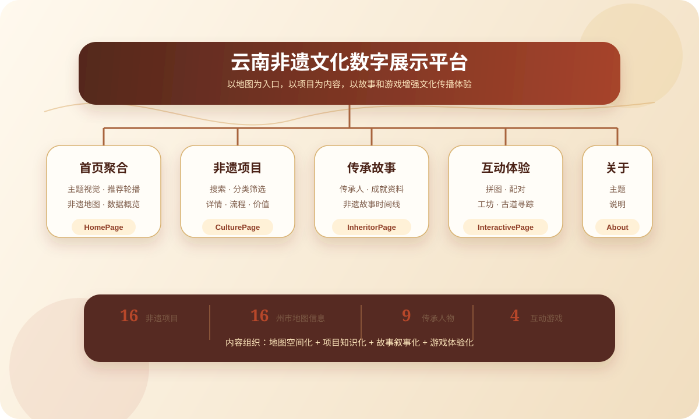
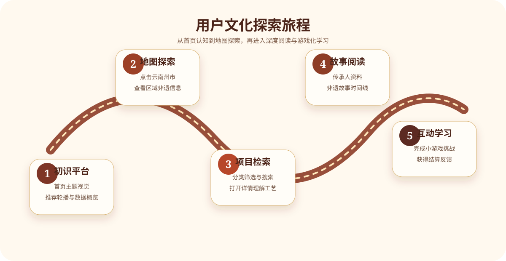
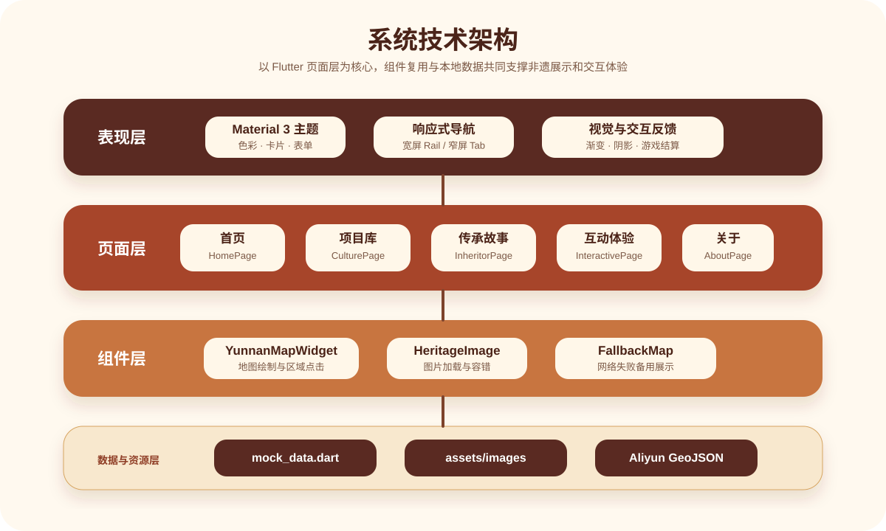
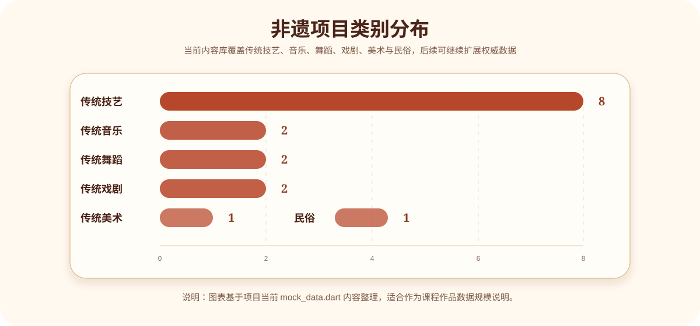
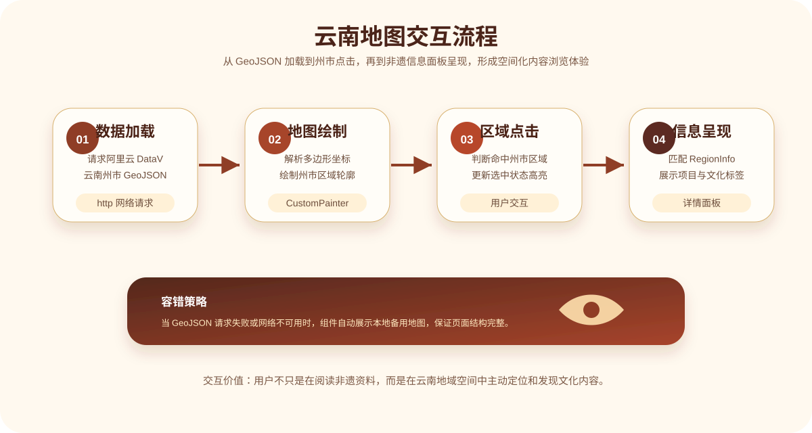

# 云南非遗文化数字展示平台

云南非遗文化数字展示平台是一个基于 Flutter 开发的 Web 静态展示型应用，围绕“云南非物质文化遗产的数字化传播”展开设计。项目将非遗项目、地域分布、传承人物、文化故事与互动小游戏整合到统一的浏览体验中，既满足课程大作业对页面结构、内容丰富度和交互性的要求，也尽量体现非遗主题应有的文化质感与设计感。

本项目最终可通过 `flutter build web` 构建为静态网站，适合部署到普通 Web 服务器、校园展示平台或静态托管服务中。

## 项目定位

本项目面向“云南非遗文化数字展示平台”主题，核心目标不是单纯堆叠文字资料，而是把非遗内容设计成可浏览、可检索、可点击、可体验的数字文化展厅。

项目重点解决以下问题：

- 让用户快速了解云南非遗的代表项目、类别和地域分布。
- 通过地图交互建立“非遗项目和州市区域”的空间联系。
- 通过传承人与故事模块强化文化传承的真实感和叙事感。
- 通过小游戏降低学习门槛，让非遗知识从静态阅读变成主动探索。
- 通过统一视觉风格提升页面完成度，使作品更符合期末展示与答辩场景。

## 功能总览

| 功能模块 | 页面位置 | 主要能力 | 用户价值 |
| --- | --- | --- | --- |
| 首页展示 | 首页 | 主题视觉、云南地图、轮播推荐、快捷入口、精选项目、知识区、数据概览 | 快速建立项目整体印象 |
| 非遗地图 | 首页、关于页 | 加载云南州市边界，点击地区查看非遗信息 | 将文化内容和地理空间关联起来 |
| 非遗项目库 | 非遗项目页 | 分类筛选、关键词搜索、项目详情、流程介绍 | 系统浏览云南非遗项目 |
| 传承人介绍 | 传承人页 | 人物卡片、成就、详情弹窗 | 展示“人”在非遗传承中的作用 |
| 非遗故事 | 传承人页 | 时间线叙事、图文故事 | 增强文化内容的可读性 |
| 互动体验 | 互动体验页 | 拼图、配对、工序复原、地域寻踪 | 用游戏化方式学习非遗知识 |
| 关于我们 | 关于页 | 项目说明、团队/主题表达、地图展示 | 完整呈现作品背景 |

## 项目亮点

### 1. 地图驱动的非遗展示

项目调用阿里云 DataV 的云南省行政区划 GeoJSON 数据，解析州市多边形并绘制云南地图。用户点击地图上的州市区域后，可以查看该地区的代表性非遗项目、文化标签和区域介绍。

地图模块相比普通图片展示更有交互意义：

- 支持真实云南行政区轮廓渲染。
- 支持州市点击与选中高亮。
- 支持区域信息面板联动展示。
- 网络加载失败时提供备用地图组件，保证页面完整性。

### 2. 内容与视觉统一

页面整体采用暖棕、赭红、米白等色彩，贴合云南民族工艺、泥陶、织锦和古道文化的视觉氛围。卡片、渐变、圆角、阴影和图文叠加布局贯穿首页、项目页和互动页，避免页面像普通资料列表。

### 3. 游戏化学习体验

互动体验页不是简单问答，而是围绕非遗内容设计了四类游戏：

- **纹样修复局**：三关滑块拼图，修复非遗图像，加入原图提示和星级评价。
- **非遗记忆馆**：六组藏品翻牌配对，加入尝试次数、连击倍率和完成奖励。
- **匠人工序工坊**：拖拽排序还原制作流程，理解非遗工艺步骤。
- **茶马古道寻踪**：根据线索选择正确州市，结合体力值、连击和奖励收集机制。

### 4. 多端响应式适配

宽屏端采用 `NavigationRail` 左侧导航，页面更像桌面端数字展厅；窄屏端采用底部导航，便于移动设备预览。项目可以在 Chrome、Windows 桌面端以及 Flutter 支持的其他平台运行。

## 页面结构图



上图从作品整体结构出发，将平台拆分为首页聚合、非遗项目、传承故事、互动体验和关于说明五个核心页面，并突出地图、项目、故事、游戏四类内容组织方式。

## 用户浏览流程



用户流程按照“初识平台、地图探索、项目检索、故事阅读、互动学习”组织，体现从浅层浏览到深度理解、再到游戏化记忆的完整体验链路。

## 技术架构



技术架构采用表现层、页面层、组件层、数据与资源层的分层方式说明，便于在课程答辩中解释页面、组件、数据和外部地图接口之间的关系。

## 数据概览

| 数据类型 | 数量 | 说明 |
| --- | ---: | --- |
| 非遗项目 | 16 项 | 覆盖传统技艺、传统音乐、传统舞蹈、传统戏剧、传统美术、民俗等类别 |
| 地图区域 | 16 个州市 | 与云南行政区地图联动展示 |
| 传承人物 | 9 位 | 包含真实资料整理与教学情境创作人物 |
| 非遗故事 | 11 条 | 包含历史介绍、传承故事和课程叙事内容 |
| 互动游戏 | 4 个 | 拼图、配对、工序复原、茶马古道寻踪 |
| 本地图片资源 | 多张 | 项目图、人物图、背景图统一放在 `assets/images/heritage/` |

## 非遗类别覆盖



> 注：类别分布用于说明当前项目内容结构，后续可根据实际数据继续扩展。

## 核心模块说明

### 首页 `HomePage`

首页承担项目的第一印象展示，重点突出云南非遗主题和地图交互入口。

主要内容包括：

- 顶部 Hero 区域：展示项目主题、文化介绍和视觉背景。
- 云南非遗地图：放在首页醒目位置，方便用户直接通过地理区域探索非遗。
- 轮播推荐：展示代表性非遗项目。
- 快捷入口：快速跳转到项目、传承人、互动体验、关于页面。
- 精选项目：以卡片形式展示重点非遗内容。
- 知识板块：解释传统技艺、民族节庆、文化传承等主题。
- 数据概览：用数字增强平台内容规模感。

### 非遗项目页 `CulturePage`

非遗项目页是平台的主要内容库，支持用户按类别和关键词查找非遗项目。

主要能力：

- 按“全部、传统技艺、传统音乐、传统舞蹈、传统戏剧”等类别筛选。
- 支持关键词搜索，例如输入“扎染”“大理”“紫陶”等。
- 项目卡片展示图片、名称、类别、地点、级别和简要描述。
- 点击卡片打开详情弹窗，展示历史价值、制作流程、传承信息等。

### 传承人与故事页 `InheritorPage`

该页面分为两个标签：

- **传承人**：展示人物头像、代表技艺、简介和成就。
- **非遗故事**：以时间线方式展示文化故事，使内容更具叙事性。

页面中对“教学情境创作”类内容做了标识，避免和真实人物资料混淆。若项目用于正式发布，建议进一步补充权威来源与出处。

### 互动体验页 `InteractivePage`

互动体验页是项目的游戏化学习模块，目标是让用户在操作中记住非遗图像、工艺流程和地理线索。

| 游戏 | 玩法 | 设计目的 |
| --- | --- | --- |
| 纹样修复局 | 移动滑块复原非遗图片，共三关 | 训练用户对非遗纹样和图像的识别 |
| 非遗记忆馆 | 翻牌寻找相同非遗藏品，共六组 | 强化项目名称与视觉形象的对应关系 |
| 匠人工序工坊 | 拖拽工序卡片，恢复正确制作顺序 | 理解非遗技艺背后的制作逻辑 |
| 茶马古道寻踪 | 根据线索选择对应州市 | 建立非遗内容与云南地域之间的联系 |

游戏模块包含关卡进度、文化能量得分、连击、体力、提示、星级结算等机制，使互动不只是静态答题。

### 云南地图组件 `YunnanMapWidget`

地图组件主要逻辑如下：



该流程体现了地图模块的四个关键环节：请求 GeoJSON、绘制州市轮廓、判断用户点击区域、展示区域非遗详情；同时保留网络失败时的备用地图展示策略。

地图数据请求地址：

```text
https://geo.datav.aliyun.com/areas_v3/bound/530000_full.json
```

如果网络请求失败，页面会使用备用地图组件，保证展示不中断。

## 技术栈

| 技术 | 用途 |
| --- | --- |
| Flutter | 跨平台 UI 开发与 Web 构建 |
| Dart | 项目主要开发语言 |
| Material 3 | 页面组件、主题和交互控件 |
| http | 请求阿里云 GeoJSON 地图数据 |
| smooth_page_indicator | 首页轮播指示器 |
| 本地 assets | 存放非遗项目、人物和背景图片 |
| CustomPainter / 自定义组件 | 地图绘制、交互区域表现 |

## 目录结构

```text
.
├── assets/
│   └── images/heritage/
│       ├── tie_dye.png
│       ├── dai_brocade.png
│       ├── jianshui_pottery.png
│       ├── yi_embroidery.png
│       ├── peacock_dance.png
│       ├── naxi_music.png
│       ├── huadeng_opera.png
│       └── ...
├── lib/
│   ├── components/
│   │   └── yunnan_map.dart
│   ├── data/
│   │   └── mock_data.dart
│   ├── pages/
│   │   ├── home_page.dart
│   │   ├── culture_page.dart
│   │   ├── inheritor_page.dart
│   │   ├── interactive_page.dart
│   │   └── about_page.dart
│   ├── widgets/
│   │   ├── heritage_image.dart
│   │   └── yunnan_administrative_map.dart
│   └── main.dart
├── test/
├── web/
├── pubspec.yaml
└── README.md
```

## 运行环境

建议环境：

- Flutter 3.x 或以上
- Dart 3.x 或以上
- Chrome 浏览器
- Windows、macOS 或 Linux 均可运行

项目 `pubspec.yaml` 中声明的主要依赖：

```yaml
dependencies:
  flutter:
    sdk: flutter
  cupertino_icons: ^1.0.8
  smooth_page_indicator: ^1.1.0
  http: ^1.2.1
```

## 本地运行

进入项目根目录后执行：

```bash
flutter pub get
flutter run -d chrome
```

如果要运行到 Windows 桌面端：

```bash
flutter run -d windows
```

## Web 构建

构建静态 Web 文件：

```bash
flutter build web
```

构建完成后，产物位于：

```text
build/web/
```

可将该目录部署到静态网站服务器。

## 代码检查与格式化

静态检查：

```bash
dart analyze lib test
```

格式化：

```bash
dart format lib test
```

运行测试：

```bash
flutter test
```

## 设计风格说明

项目视觉风格围绕“云南非遗”“手工艺”“民族文化”“古道与山川”展开，主要采用以下设计策略：

- **色彩**：以赭红、陶土棕、米白、金色为主，贴合扎染、陶器、织锦和传统建筑的文化气质。
- **卡片化布局**：降低信息密度，使大量文字资料更容易阅读。
- **图文结合**：每个重点非遗项目配图展示，避免纯文字页面单调。
- **地图优先**：将云南地图放在首页较醒目位置，强化地域主题。
- **游戏化反馈**：得分、星级、体力、提示、连击等机制提升互动完成度。

## 内容来源与说明

当前项目中的内容主要用于课程展示和学习交流：

- 真实非遗项目资料根据公开常识与课程需求整理。
- 图片资源来自项目本地素材目录。
- 部分传承人和故事内容包含教学情境创作，并在页面中进行标识。
- 若项目用于正式公开发布，应补充权威来源链接、版权声明和图片授权信息。

## 可扩展方向

| 方向 | 具体优化 |
| --- | --- |
| 数据权威性 | 接入正式非遗名录、政府公开资料或博物馆数据 |
| 地图增强 | 增加缩放、悬停提示、类别筛选、热力分布 |
| 游戏增强 | 增加音效、倒计时、关卡解锁、本地最高分 |
| 内容增强 | 增加视频、访谈、工艺步骤图、少数民族术语解释 |
| 部署优化 | 压缩图片、配置缓存、优化 Web 首屏加载速度 |
| 多端体验 | 针对手机、平板、桌面分别优化布局细节 |

## 项目价值

从课程作品角度看，本项目覆盖了 Web 展示类大作业常见要求：

- 有明确主题和完整页面结构。
- 有图文内容、分类筛选、搜索、地图、游戏等多种交互。
- 有较清晰的数据组织和组件拆分。
- 有可构建为静态网站的交付方式。
- 有文化主题与思政表达空间。

从文化传播角度看，项目尝试把云南非遗从“资料阅读”转化为“地图探索 + 故事浏览 + 游戏体验”的综合展示方式，让用户在更轻松的交互中理解非遗项目、地域文化和传承价值。

## 总结

云南非遗文化数字展示平台以 Flutter 为技术基础，以云南非物质文化遗产为内容核心，通过首页展示、地图交互、项目检索、传承人故事和互动小游戏形成完整的数字展示体验。项目既具备课程作品所需的完整度，也保留了继续扩展为正式文化展示平台的空间。
